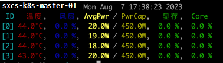
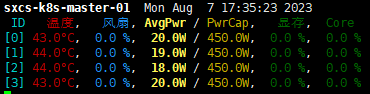
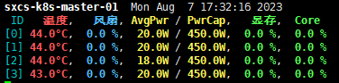

# `gcustat`

一个能够简洁的显示海光 DCU 设备状态的命令行工具；

之前使用GPU时习惯了使用工具 [`gpustat`](https://github.com/wookayin/gpustat) 查看GPU状态，使用海光的 DCU 设备之后发现并没有类似的工具，于是仿照  [`gpustat`](https://github.com/wookayin/gpustat) 自己写了一个；
显示效果如下图：

<div align=center></div>

## 依赖说明

python版本要求：`python>=3.6`；

## 安装说明

```
pip install dcustat
```

## 使用说明

使用如下命令单次获取当前 dcu 设备信息：

```shell
dcustat
```

使用如下命令动态刷新当前 dcu 设备信息，默认每2秒刷新一次：

```
dcustat --watch
```

可选参数如下：

```
usage: cli.py [-h] [-i [INTERVAL]] [--light] [--debug] [-v]

optional arguments:

  -h, --help            show this help message and exit

  -i [INTERVAL], --interval [INTERVAL], --watch [INTERVAL]
                        动态刷新模式；INTERVAL为刷新间隔，单位：秒；默认每2秒刷新一次；

  --light               使用较亮的模式显示，如果显示器渲染出来的结果较暗，可以打开该参数；

  --debug               Debug模式时允许在程序出错的情况下打印更多的调试信息；

  -v, --version         show program's version number and exit
```

### 参数 --light 说明

有的显示器渲染结果中部分指标比较暗，如下图左侧所示。此时可以添加上 --light 参数，所有的结果都会以更亮的形式进行显示，如下图右侧所示。

|默认|加--light参数|
|---|---|
|||

## 显示内容说明

```
sxcs-k8s-master-01  Mon Aug  7  17:35:53 2023
 ID   温度,   风扇,  AvgPwr / PwrCap,  显存,  Core
[0] 43.0°C,  0.0%,  20.0W / 450.0W,  0.0%,  0.0%
[1] 43.0°C,  0.0%,  20.0W / 450.0W,  0.0%,  0.0%
[2] 43.0°C,  0.0%,  20.0W / 450.0W,  0.0%,  0.0%
[3] 43.0°C,  0.0%,  20.0W / 450.0W,  0.0%,  0.0%
```

* header：第1行为header，展示的信息从左到右依次为机器名称、当前时间；

* title：第2行为title，title是对后面展示的信息的各字段的说明。"AvgPwr" 列是平均功率，"PwrCap" 列是显卡的功率上限，"显存" 列是当前显存的使用率，"Core" 列是当前计算资源的使用率。

## Reference

本项目的灵感、排版展示、以及代码的整体结构都是源自 [`gpustat`](https://github.com/wookayin/gpustat)，本项目只是将其工作适配到了海光 DCU 设备上；

## License

[MIT License](./LICENSE)
